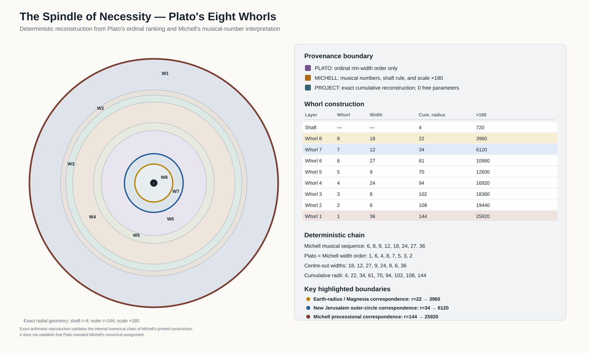
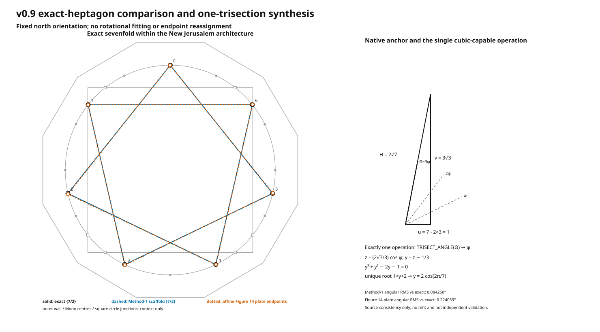
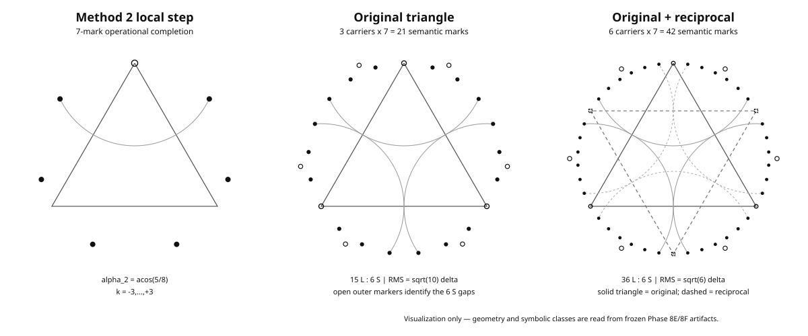

# New Jerusalem Geometry

**A reproducible computational and historical audit of John Michell's New
Jerusalem geometry.**

New Jerusalem Geometry turns a visually and historically complex diagram into
an explicit system of Euclidean constructions, source-calibrated comparisons,
deterministic numerical reconstructions, and provenance-labelled claims.

The project is designed around a simple rule:

> Historical source statements, project reconstructions, exact mathematical
> results, approximate constructions, and interpretive claims must remain
> distinguishable from one another.

Version 1.0 consolidates the full geometry audit developed through the v0.x
checkpoints and adds a frozen historical/numerical reconstruction of Michell's
interpretation of Plato's eight whorls.



## What v1.0 establishes

The v1.0 scientific boundary contains five main results.

### 1. A deterministic New Jerusalem geometry

The repository contains an executable `NJG_MICHELL` forward composite built
from explicit construction rules rather than from free placement of graphical
elements.

Its frozen generative layer includes:

- the normalized Earth–Moon core;
- the exact-incidence `NJG_INC` Moon system;
- Michell's four groups of three Moon circles;
- the preferred polar-pivot reconstruction of the Figure 12 outer wall;
- Michell's approximate Method-1 sevenfold construction;
- the reciprocal fourteenfold construction;
- the four-triangle 28-point scaffold;
- a scaffold-derived `{7/2}` Figure 14 candidate.

The integrated composite accepts only the overall scale unit as a
caller-supplied geometric quantity. Source-plate calibration and measured
source landmarks remain downstream of the generative model.

### 2. Source-calibrated Figures 12 and 14

The project directly audits Michell's printed geometry rather than assuming
that a visually plausible reconstruction is historically correct.

For Figure 12, three outer-wall rules were compared against the
affine-calibrated source wall. The preferred `POLAR_PIVOT_TANGENT`
reconstruction gives the best wall-direction agreement while also reproducing
Michell's later dimensional values closely.

Frozen Figure 12 diagnostics include:

```text
wall-normal angular RMS           1.019836 deg
wall-support RMS                  0.038999 u
wall-vertex RMS                   0.100022 u
perimeter difference              -0.379134%
area difference                   -0.709332%
```

The support-distance metric alone favours another comparator, so the
polar-pivot wall is described as a **source-supported project reconstruction**,
not as a uniquely established historical construction.

For Figure 14, independent printed-stroke tracing supports the `{7/2}`
heptagram topology over the earlier provisional `{7/3}` interpretation.

The fixed scaffold-derived `{7/2}` candidate modestly improves on a fixed
canonical regular comparator, but this is source-consistency synthesis rather
than statistically independent validation.

### 3. The sevenfold constructibility boundary

The exact regular sevenfold target can be written as:

```text
y = 2*cos(2*pi/7)
```

with irreducible minimal polynomial:

```text
y^3 + y^2 - 2*y - 1 = 0
```

Because the target has algebraic degree three over `Q`, it is excluded from the
frozen ordinary straightedge-and-compass quadratic closure.

The project then preregistered one specific cubic-capable extension using
exactly one:

```text
TRISECT_ANGLE
```

operation.

Within that frozen operation-count model:

```text
0 cubic-capable operations: impossible
1 cubic-capable operation:  sufficient
```

This is a project mathematical result. It is **not** attributed to Michell,
Sommerville, Plato, or an ancient source.

Canonical figure:



### 4. Michell's two approximate sevenfold methods

Michell's Figure 194 describes two distinct approximate branches:

```text
Method 1: 7 -> 14 -> 28
Method 2: 7 -> 21 -> 42
```

The frozen local steps are:

```text
exact 360/7       51.42857142857143 deg
Method 1          51.47070143243995 deg
Method 2          51.31781254651057 deg
```

so:

```text
Method 2 < exact < Method 1
```

Method 1 is locally more accurate.

For Method 2, the project derives:

```text
alpha_2 = acos(5/8)
```

and shows that the complete 21- and 42-point nonuniformity follows exactly from
the single local deficit:

```text
delta = 2*pi/7 - alpha_2
```

with:

```text
RMS_21   = sqrt(10)*delta
MAX_21   = 5*delta
RANGE_21 = 7*delta

RMS_42   = sqrt(6)*delta
MAX_42   = 6*delta
RANGE_42 = 7*delta
```

The reciprocal stage lowers raw RMS while increasing worst-case and normalized
RMS, so it is not assigned a single unqualified "more regular" or "less
regular" label.

Canonical figure:



### 5. Plato's eight whorls and Michell's numerical interpretation

The v1.0 historical audit separates three provenance layers:

```text
DIRECT_PLATO_TEXT
MICHELL_EXPLICIT
PROJECT_RECONSTRUCTION
```

The frozen Plato extraction establishes eight nested whorls and the ordinal
rim-width order:

```text
1 > 6 > 4 > 8 > 7 > 5 > 3 > 2
```

The audited Plato passage does **not** provide numerical magnitudes or ratios
for those widths.

Michell preserves the same ordinal order and supplies the musical-number set:

```text
6, 8, 9, 12, 18, 24, 27, 36
```

Assigning those numbers by the frozen ordinal width ranking produces Michell's
centre-out sequence:

```text
18, 12, 27, 9, 24, 8, 6, 36
```

Michell's shaft rule gives:

```text
6 * 2/3 = 4
```

and cumulative radii:

```text
4, 22, 34, 61, 70, 94, 102, 108, 144
```

Under Michell's printed scale factor of `180`:

```text
720, 3960, 6120, 10980, 12600,
16920, 18360, 19440, 25920
```

The reconstruction uses:

```text
free parameters          0
nearest-match choices    0
optimisations            0
permutation searches     0
scale fits               0
```

It exactly reproduces Michell's printed `3960`, `6120`, and `2160`
correspondence values from the frozen inputs.

That arithmetic result has a strict historical boundary:

> Exact reproduction validates the internal numerical chain of Michell's
> printed construction. It does not establish that Plato supplied Michell's
> numerical widths, intended Michell's assignment, or transmitted the scheme
> historically from antiquity.

## Evidence and provenance boundaries

The repository intentionally distinguishes the status of different claims.

| Layer | Meaning |
| --- | --- |
| `DIRECT_PLATO_TEXT` | Literal information recoverable from the frozen Plato witnesses |
| `MICHELL_EXPLICIT` | Numerical or construction statements explicitly supplied by Michell |
| `PROJECT_RECONSTRUCTION` | Deterministic arithmetic or geometry carried out by this project |
| source-calibrated comparison | Comparison against digitised printed source geometry |
| exact mathematical result | Algebraic or Euclidean result proved independently of visual fit |
| visualisation-only | Downstream rendering that does not feed back into model selection |
| `ARCHIVAL_PENDING` | Historical lead not yet established from frozen primary material |
| `INTERPRETIVE_EXCLUDED` | Material deliberately excluded from the v1.0 evidential layer |

The canonical Plato/Michell claim matrix is:

```text
docs/sources/v1.0_plato_michell_claim_matrix.csv
```

## What the project does not claim

Version 1.0 does **not** establish:

- that Plato encoded Michell's numerical whorl widths;
- ancient transmission of Michell's numerical scheme;
- that Michell knew the project's exact one-trisection construction;
- that Sommerville knew the project's exact one-trisection construction;
- intentional ancient encoding of the exact heptagon;
- a physical or metaphysical mechanism behind the geometry;
- statistically independent validation from source plates that informed model
  development;
- unique optimality of angle trisection among all cubic-capable construction
  technologies.

Those boundaries are part of the result, not caveats added after the fact.

## Reproducibility

Create an isolated environment:

```bash
python3 -m venv .venv
source .venv/bin/activate
python -m pip install --upgrade pip
python -m pip install -e ".[dev]"
```

Run the complete automated suite:

```bash
pytest
```

At the frozen v1.0 scientific checkpoint:

```text
806 passed
15 skipped
```

The fifteen skipped tests are retained historical package-version sentinels.
They do not represent failing applicable analytical or geometric tests.

Run the core verification:

```bash
python scripts/verify_core_geometry.py
```

Generate the integrated Michell composite:

```bash
python scripts/generate_michell_composite.py
```

Generate the v1.0 Plato–Michell capstone:

```bash
python scripts/generate_v1_0_plato_michell_whorl_capstone.py
```

The frozen capstone SHA-256 is:

```text
379bcbecf524890a055b3aa8cc926f54320cd8fffd8adacf29f63fdc68bf81d9
```

## Canonical visualizations

| Figure | Artifact |
| --- | --- |
| Normalized Earth–Moon core | `figures/generated/cardinal_core.svg` |
| Oblique Moon-model comparison | `figures/generated/oblique_models_comparison.svg` |
| Michell 28-point scaffold | `figures/generated/michell_28_point_scaffold.svg` |
| Figure 14 heptagram comparison | `figures/generated/michell_figure14_heptagram.svg` |
| Integrated `NJG_MICHELL` composite | `figures/generated/njg_michell_composite.svg` |
| Sommerville dodecagon dimensional audit | `figures/generated/sommerville_dodecagon_dimensional_audit.svg` |
| Figure 194 Method-2 propagation | `figures/generated/v0.8_method2_7_21_42.svg` |
| Exact sevenfold synthesis | `figures/generated/v0.9_exact_heptagon_synthesis.svg` |
| Plato–Michell eight-whorl capstone | `figures/generated/v1.0_plato_michell_whorl_capstone.svg` |

Generated figures are downstream of the tested geometry. Canonical tracked SVGs
are retained for reproducibility.

## Repository guide

The main project layers are organised as:

```text
src/new_jerusalem_geometry/    executable geometry and verification
scripts/                       deterministic analysis/generation entry points
tests/                         automated verification
data/analysis/                 frozen numerical analysis outputs
data/geometry/                 machine-readable geometry exports
data/provenance/               provenance manifests
data/sources/                  frozen source inputs and source-freeze records
docs/checkpoints/              signed-version scientific checkpoints
docs/geometry/                 result syntheses and release-readiness records
docs/sources/                  source audits and claim matrices
docs/specification/            preregistered protocols and construction grammar
figures/generated/             canonical generated SVG artifacts
```

## Historical checkpoints

The v0.x checkpoints are preserved as an auditable development history rather
than rewritten into the current narrative.

Key checkpoints include:

```text
v0.1.0  initial architectural reconstruction
v0.2.0  Figure 14 source calibration
v0.3.0  Figure 12 source calibration
v0.4.0  frozen forward validation
v0.5.0  integrated generative composite and provenance
v0.6.0  historical metrology and prediction-status audit
v0.7.0  Sommerville dodecagon vertex-radius audit
v0.8.0  Figure 194 dual-method sevenfold audit
v0.9.0  exact sevenfold constructibility boundary and cubic extension
v1.0.0  Plato–Michell historical/numerical synthesis and scientific freeze
```

Detailed checkpoint records are under:

```text
docs/checkpoints/
```

### Frozen v0.8/v0.9 checkpoint wording

The following statements are retained explicitly because they are part of the
signed historical release boundary.

Version `v0.8.0` remains the historical Figure 194 dual-method construction
checkpoint.

Its frozen branches are:

```text
Method 1: 7 -> 14 -> 28
Method 2: 7 -> 21 -> 42
```

The project-derived local identity is:

```text
alpha_2 = acos(5/8)
```

The symbolic gap derivation is **post-result explanatory** work, and the
canonical v0.8 SVG remains **visualization-only**.

Version `v0.9.0` is the **Exact Sevenfold Boundary and Minimal Cubic Extension** checkpoint.

Its frozen terminal classifications include:

```text
EUCLIDEAN_EXACT_SEVENFOLD_EXCLUDED

ONE_TRISECTION_EXACT_HEPTAGON_CONFIRMED

MINIMUM_ONE_CUBIC_CAPABLE_OPERATION_WITHIN_FROZEN_MODEL
```

The exact construction is a project mathematical result and is **not attributed**
to Michell, Sommerville, Plato, or an ancient source.

The Figure 14 comparison remains **source-consistency synthesis**, not
statistically independent validation.

The frozen v1.0 release-readiness record is:

```text
docs/geometry/v1.0_release_readiness_result.md
```

## Licensing

Original project software is released under the MIT License.

See:

```text
LICENSE
```

The repository also includes two frozen Perseus Digital Library Plato XML
witnesses used by the v1.0 historical audit. They remain subject to their
upstream CC BY-SA 4.0 licensing and are not relicensed under MIT.

See:

```text
THIRD_PARTY_NOTICES.md
data/sources/v1_0/plato/README.md
```

## Citation

Citation metadata is provided in:

```text
CITATION.cff
```

The archival DOI will be propagated to the citation surfaces after the public
v1.0.0 archival release is created.

## Author

**Salah-Eddin Gherbi**<br>
Independent Researcher, United Kingdom<br>
ORCID: `0009-0005-4017-1095`
